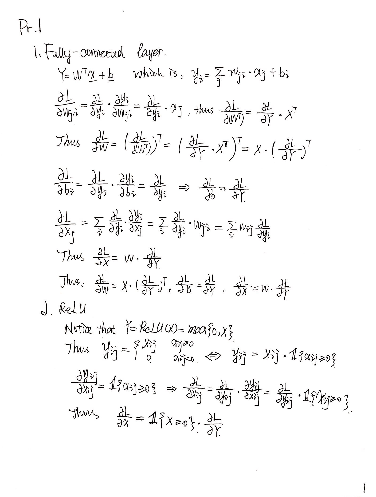
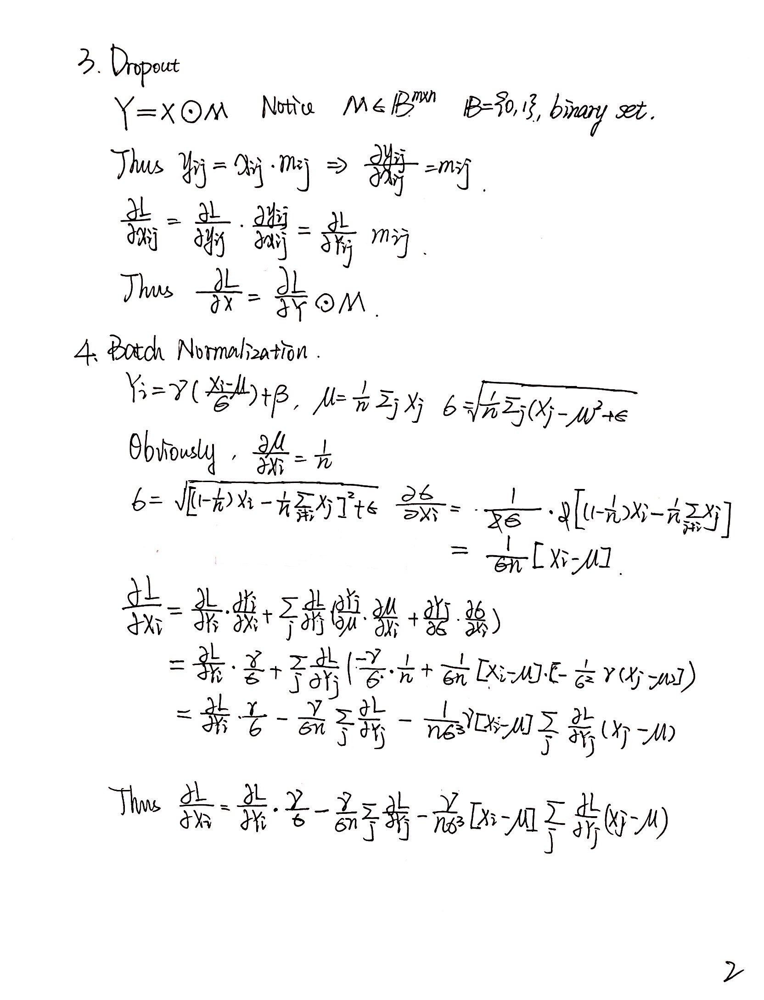
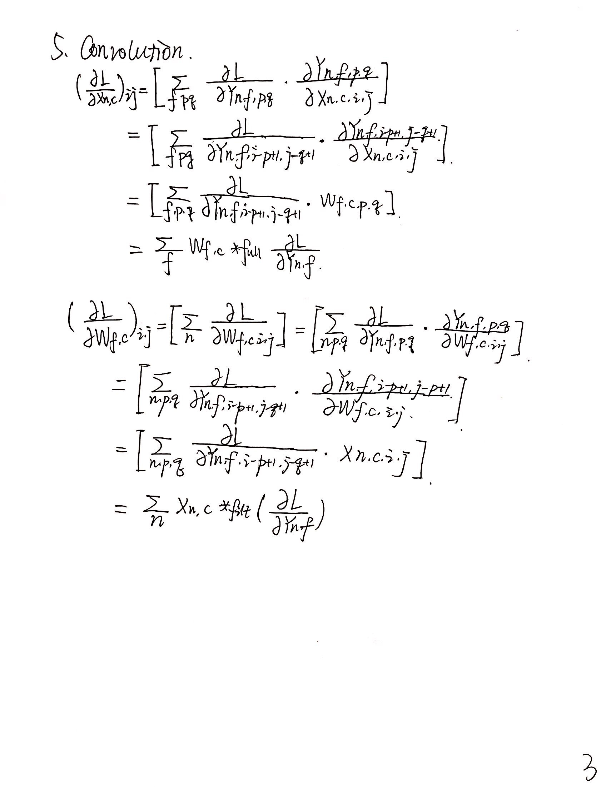

### EECS 598 Deep Learning
### Assignment 1
---
*Shuyang HUANG*
*68621288*

---
#### 1. 
<center>  </center>
<center>  </center>
<center>  </center>

#### 2.Logistic Classifier

##### a.
```python
model = LogisticClassifier(input_dim=20, hidden_dim = None, reg = 0, weight_scale=1e-1)
controller = Solver(model, data,
                    update_rule='sgd_momentum',
                    optim_config={
                    'learning_rate': 1e0,
                },
                    lr_decay=0.95,
                    num_epochs=160, batch_size=50,
                    print_every=100)
```
This is the parameters used, and reached an accuarcy of $92\%$ with test data.

##### b.
```python
model = LogisticClassifier(input_dim=20, hidden_dim = 120, reg = 0, weight_scale=1e-1)
controller = Solver(model, data,
                    update_rule='sgd_momentum',
                    optim_config={
                    'learning_rate': 1e0,
                },
                    lr_decay=0.95,
                    num_epochs=160, batch_size=50,
                    print_every=100)
```
This is the parameters used, and reached an accuracy of $91.4\%$ with test data.


#### 3. SVM Classifier
##### a.
```python
model = SVM(input_dim=20, hidden_dim = None, reg = 0, weight_scale=1e-2)
controller = Solver(model, data,
                    update_rule='sgd_momentum',
                    optim_config={
                    'learning_rate': 1e0,
                },
                    lr_decay=0.98,
                    num_epochs=200, batch_size=50,
                    print_every=100)
```
This is the parameters used, and reached an accuracy of $92.8\%$ with test data.

##### b.
```python
model = SVM(input_dim=20, hidden_dim = 120, reg = 0, weight_scale=1e-2)
controller = Solver(model, data,
                    update_rule='sgd_momentum',
                    optim_config={
                    'learning_rate': 1e0,
                },
                    lr_decay=0.95,
                    num_epochs=200, batch_size=50,
                    print_every=100)
```
This is the parameters used, and reached an accuracy of $93.2\%$ with test data.


#### 4. Softmax Regression
##### a.
```python
model = SoftmaxClassifier(input_dim=28*28, hidden_dim = None, reg = 0, num_classes=10, weight_scale=1e-3)
controller = Solver(model, data,
                    update_rule='sgd_momentum',
                    optim_config={
                    'learning_rate': 1e-5,
                },
                    lr_decay=0.95,
                    num_epochs=10, batch_size=50,
                    print_every=100)
```
This is the parameters used, and reached an accuracy of $90.2\%$ with test data.
##### b.
```python
model = SoftmaxClassifier(input_dim=28*28, hidden_dim = 600, reg = 0, num_classes=10, weight_scale=1e-3)
controller = Solver(model, data,
                    update_rule='sgd_momentum',
                    optim_config={
                    'learning_rate': 1e-3,
                },
                    lr_decay=0.8,
                    num_epochs=4, batch_size=50,
                    print_every=100)
```
This is the parameters used, and reached an accuracy of $96.71\%$ with test data.

#### 5. Convolutional Neural Network
##### a.
```python
model = ConvNet(input_dim=(1, 28, 28), hidden_dim = 600, reg = 0, num_classes=10, weight_scale=1e-3, drop_out = False)
controller = Solver(model, data,
                    update_rule='sgd_momentum',
                    optim_config={
                    'learning_rate': 1e-3,
                },
                    lr_decay=0.9,
                    num_epochs=15, batch_size=50,
                    print_every=1)
```
This is the parameters used, and reached an accuracy of $98.7\%$ with test data.
##### b.
```python
model = ConvNet(input_dim=(1, 28, 28), hidden_dim = 600, reg = 0, num_classes=10, weight_scale=1e-3, drop_out = True)
controller = Solver(model, data,
                    update_rule='sgd_momentum',
                    optim_config={
                    'learning_rate': 1e-3,
                },
                    lr_decay=0.9,
                    num_epochs=15, batch_size=50,
                    print_every=1)
```
This is the parameters used, and reached an accuracy of $98.9\%$ with test data.

#### 6. VGG11
With nothing changed, the result shows:
```text
Accuracy of the network on the 10000 test images: 70 %
```


#### 7. Short answer question
##### a.
Sigmoid function, $f(x)=\frac{1}{1+\exp{-x}}$, maps the the real number range into the range $[0, 1]$. With this realized, values will more likely to be hushed onto values approaching $0$ and $1$, and thus saturate at the these two points. With inproper initial values or inproper model, sigmoid have the chance to perform pretty bad.

##### b.

Suppose that, at a probaility $p$, we randomly drop a neuron, which means, at probability $p$, the contribution to a output will not counted into our current estimation $\hat{y}$. Thus, to ensure the difference, or the grandient not mismatch too much, we should consider the $(1-p)y$ as the standard values, to reduce the mismatch.

##### c.

Reduce the decay, thus to ensure the learning step reduce quickly, to avoid the over-fitting.


