### EECS 598 Deep Learning
### Assignment 2
---
*Shuyang HUANG*
*68621288*

---

#### 1. Transfer learning

All blank blocks are filled.
Followings are some fragments of the outputs:
```
Finetune the pre-trained model
Performance of pre-trained model without finetuning
Training complete in 0m 4s
Best val Acc: 0.692810
Finetune the model
Epoch 0/24
----------
train Loss: 0.7278 Acc: 0.6639
val Loss: 0.4004 Acc: 0.8431
Epoch 1/24
----------
train Loss: 0.4132 Acc: 0.8402
val Loss: 0.2916 Acc: 0.8889

...
...
...

----------
train Loss: 0.3029 Acc: 0.8607
val Loss: 0.2142 Acc: 0.9281
Epoch 23/24
----------
train Loss: 0.2656 Acc: 0.8811
val Loss: 0.2085 Acc: 0.9281
Epoch 24/24
----------
train Loss: 0.2692 Acc: 0.8852
val Loss: 0.2116 Acc: 0.9346
Training complete in 2m 57s
Best val Acc: 0.934641
Freeze the parameters in pre-trained model and train the final fc layer
Performance of pre-trained model without finetuning
Training complete in 0m 3s
Best val Acc: 0.607843
Finetune the model
Epoch 0/24
----------
train Loss: 0.5131 Acc: 0.7336
val Loss: 0.2405 Acc: 0.9281
Epoch 1/24
----------
train Loss: 0.4564 Acc: 0.8033
val Loss: 0.2451 Acc: 0.9150

...
...
...

Epoch 22/24
----------
train Loss: 0.2971 Acc: 0.8852
val Loss: 0.1951 Acc: 0.9412
Epoch 23/24
----------
train Loss: 0.2605 Acc: 0.8893
val Loss: 0.1998 Acc: 0.9477
Epoch 24/24
----------
train Loss: 0.3293 Acc: 0.8484
val Loss: 0.1973 Acc: 0.9412
Training complete in 2m 24s
Best val Acc: 0.960784

```
As we can see, tranfer learning gives us a higher correctness while using less time. Since the GPU accleration is actived, the time consumings are close to each other, while in the full cpu mode, the difference of time consumption is clearly different.

#### 2. Style Transfer
All blanks are filled.
Followings are the results.
<center> 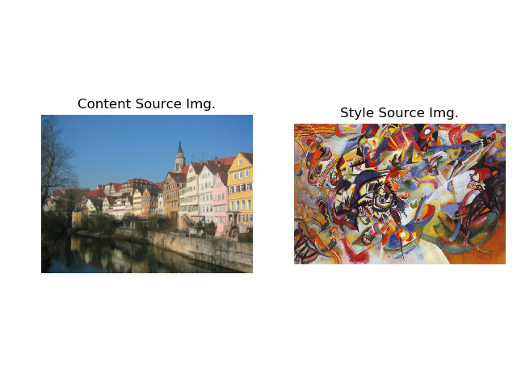 </center>
<center> 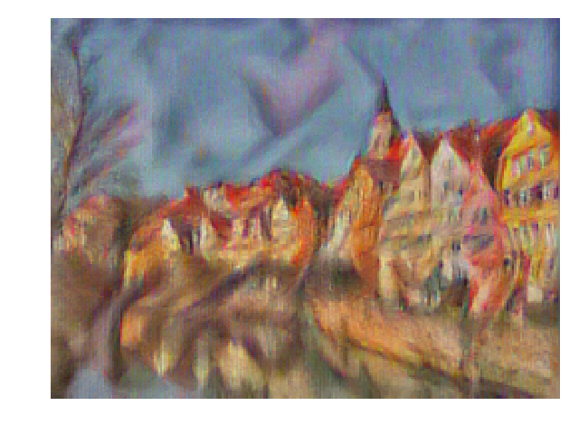 </center>
<center> 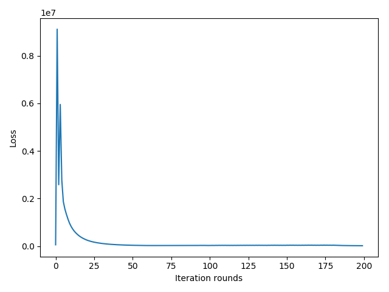 </center>
<center> 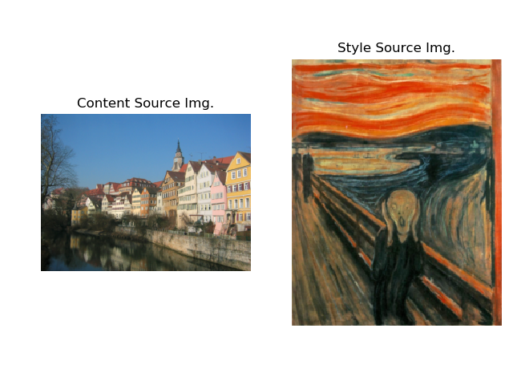 </center>
<center> 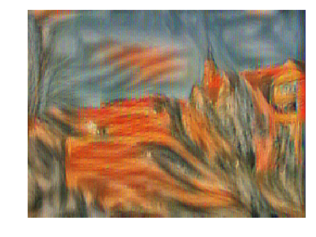 </center>
<center>  </center>
<center> 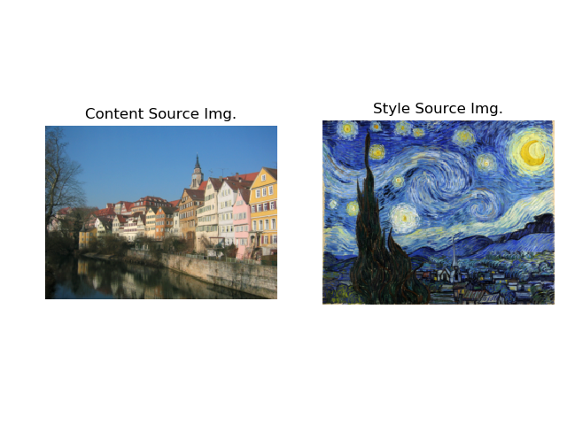 </center>
<center> 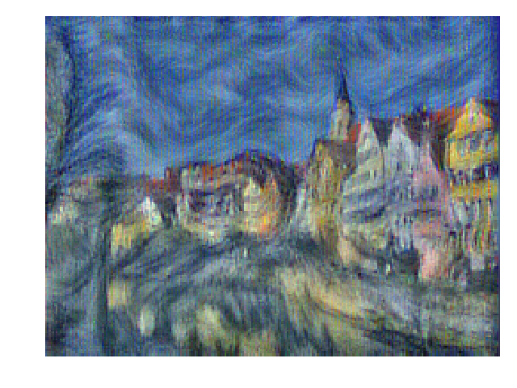 </center>
<center> 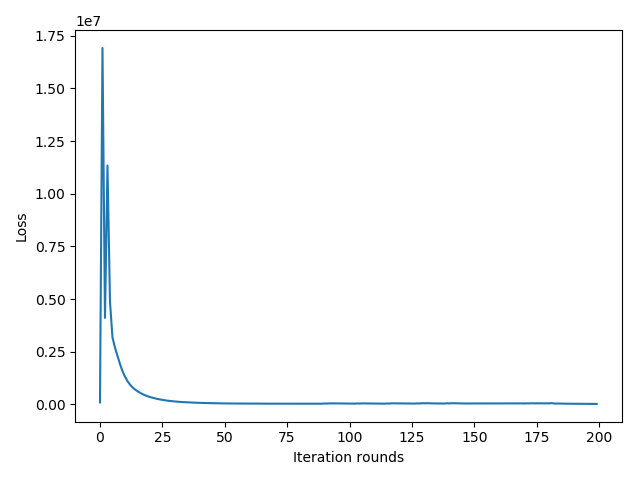 </center>
As we can see, style transfer works well. The losses decrese significantly, and the obtained figures somehow reflect the features the style source image.

#### 3. Forward and Backward propagation module for RNN
All blanks are filled.
<center> 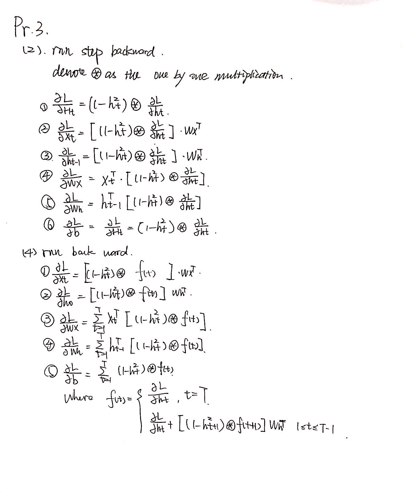 </center>

#### 4. Forward and Backward propagation module for LSTM
All blanks are filled.
<center> 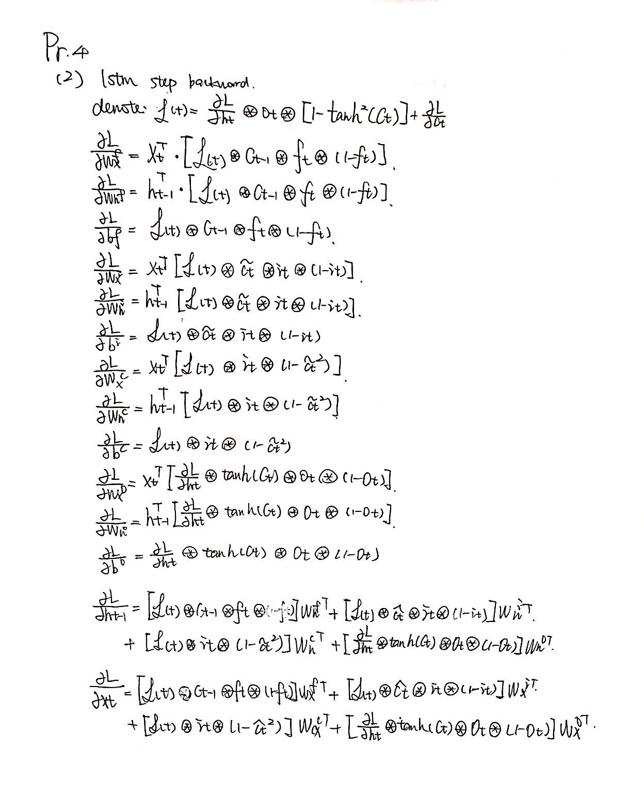 </center>
<center> 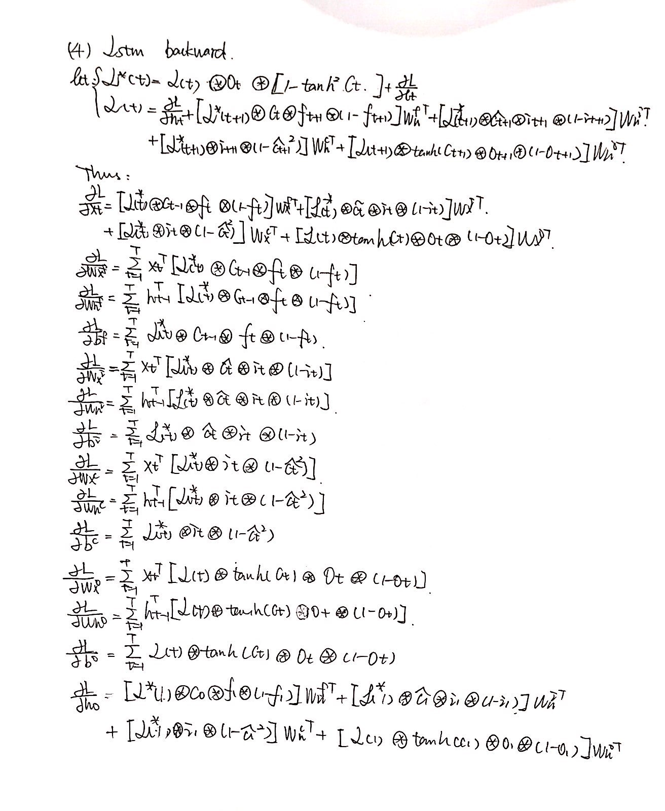 </center>

#### 5. Application to Image Captioning
All blanks are filled.
Followings are the results for image caption.

<center> 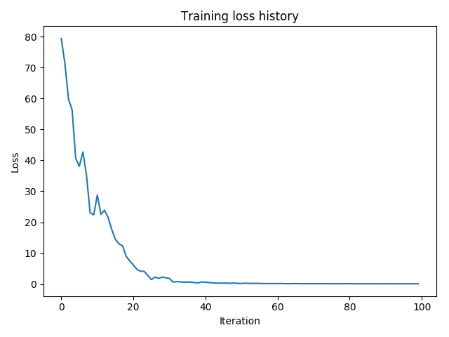 </center>
<center> 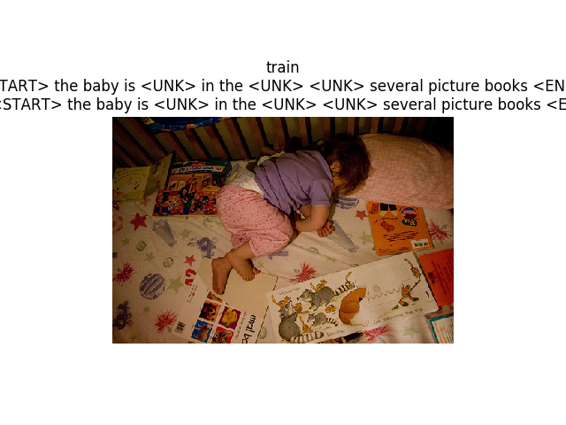 </center>
<center> 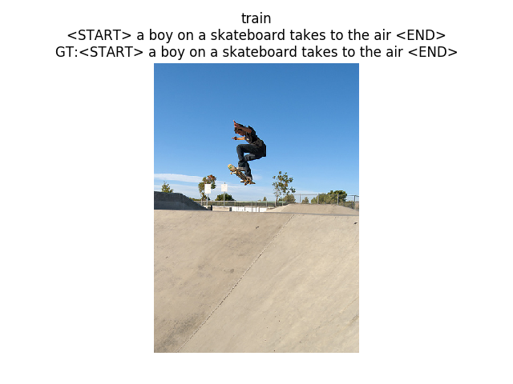 </center>
<center> 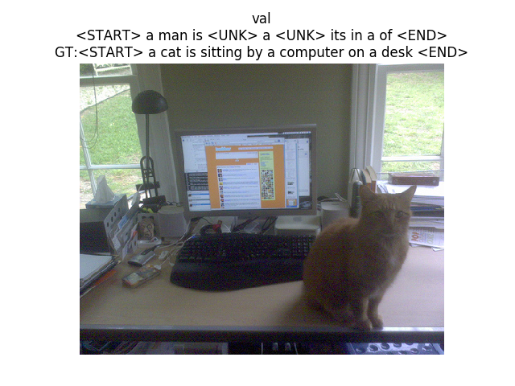 </center>
<center> 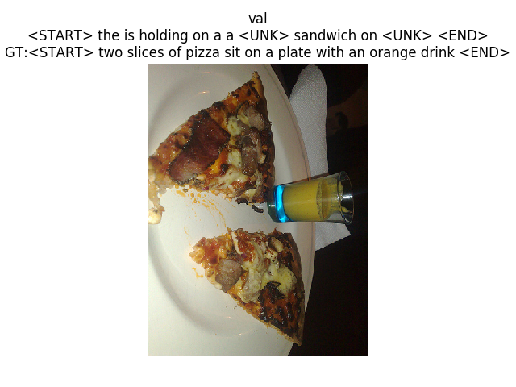 </center>
<center> 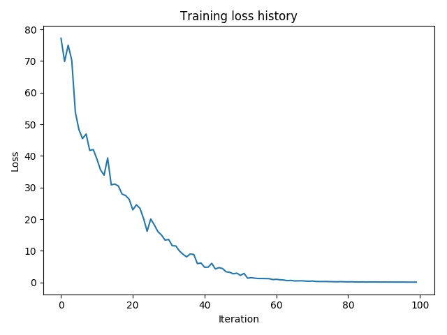 </center>
<center> 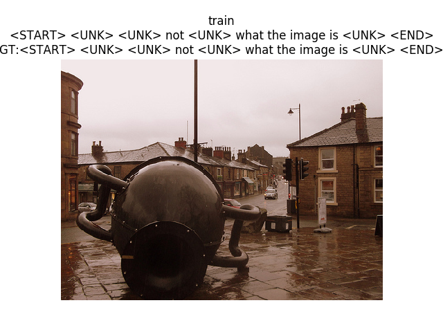 </center>
<center> 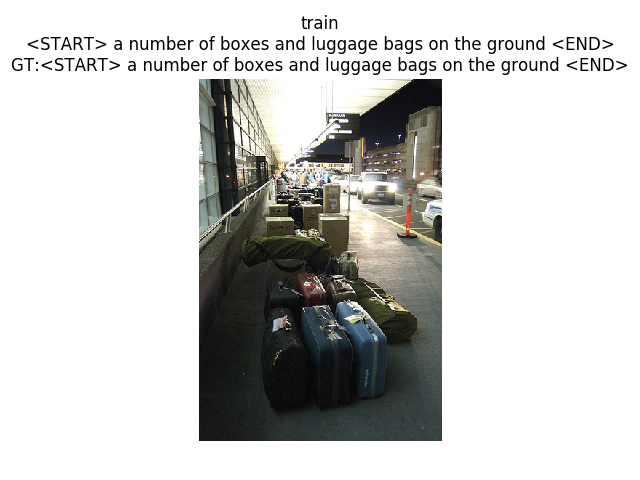 </center>
<center> 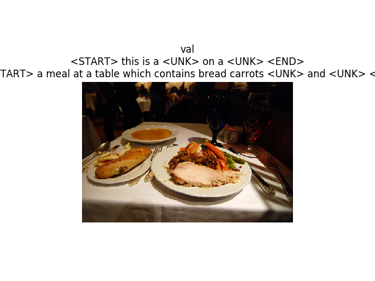 </center>