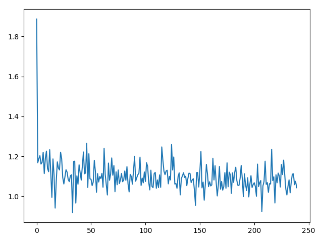

### EECS 598 Deep Learning
### Assignment 3
---
*Shuyang HUANG*
*68621288*

---

#### 1. Text Classification using CNNs

1. The expression could be written as $Y_{n,f} = X_n *_{filt}W_{f}^{conv}+b_f $.
2. The size of $Y_{n,f}$, in terms of $H$ and $H'$, is $size(Y_{n,f})=H-H'+1$.
3. The size after the pooling layer is $(N, F, 1)​$, thus a `view` function should be called to adjust the dimensions.

The corresponding implementations had been finished. Preset $epoch\_num = 25​$, $C = 300​$, $F = 128​$ and $batch\_size=1000​$. Selected and tested with different pooling method and kernel size $H'​$. Following was the result.

| Size of H' | Average pooling| Max pooling |
|:--:|:-:|:--:|
|5 | 94.2100 % |95.2400%|
|7 | 94.1200 % |94.8700 %|

As we can observe, generally, max pooling leads to a better result, and when size of $H'$ is fixed as 5, we get a better result. This makes sense intuitively. Max pooling ensures a better performance of feature selection, while a proper kernel size ensures results will not affected by some irrelevant factors.


#### 2. Siamese Networks for Learning Embeddings

All blocks are filled with no bugs, and following is the loss histroy graph. As we can see, the loss decrease greatly at the beginning, and go stable at last.
<center>  </center>

Followings are some testing results. As we can observe, though generally the function works well, not always this method works well. 
<center>  </center>
<center>  </center>
<center>  </center>
<center>  </center>
<center>  </center>
<center>  </center>


#### 3. Conditional Variational Autoencoders
1. To simplify the derivation, use $P$ and $Q$ to denote functions $p_\theta$ and $q_\phi$. By conditional probability, we have:
$$
P(X)=\int P(X|z)P(z) dz
$$
Introduce the KL divergence metric, we have:
$$
\begin{align}
D_{KL}[Q(z|X) || P(z|X)] & = \sum Q(z|X) \log \frac{Q(z|X)}{P(z|X)} \\
& = E[\log \frac{Q(z|X)}{P(z|X)}]\\
& = E[\log Q(z|X) - \log P(z|X)]
\end{align}
$$
Plug in the first equation we use, replace $P(z|X)​$ with the Bayesian expression:
$$
\begin{align}
D_{KL}[Q(z|X) || P(z|X)] & = E[\log Q(z|X) - \log \frac{P(X|z)P(z)}{P(X)}] \\
& = E[\log Q(z|X) -\log P(X|z) - \log P(z) + \log P(X)]
\end{align}
$$

Notice that, on the left, assume $X$ is a given term, thus $P(X)$ should be considered as a fixed term, thus it becomes:
$$
\begin{align}
D_{KL}[Q(z|X) || P(z|X)] - \log P(X) & = E[\log Q(z|X) -\log P(X|z) - \log P(z)] \\
& = -E[\log P(X|z)] + E[-\log P(z) + \log Q(z|X)]\\
& = -E[\log P(X|z)] + D_{KL}[Q(z|X)||P(z)]
\end{align}
$$
which is:
$$
\log P(X) - D_{KL}[Q(z|X) || P(z|X)] =E[\log P(X|z)] - D_{KL}[Q(z|X)||P(z)]
$$
Consider the case that $Y$ is given, we can derive that:
$$
\log P(X|Y) - D_{KL}[Q(z|X,Y) || P(z|X,Y)] =E[\log P(X|z,Y)] - D_{KL}[Q(z|X,Y)||P(z|Y)]
$$
Thus we have:
$$
\log P(X|Y) \ge E[\log P(X|z,Y)] - D_{KL}[Q(z|X,Y)||P(z|Y)]
$$
Under full expression, it is:
$$
\log p_\theta (x|y) \ge \mathbb{E}_{q_\phi(z|x,y)}[\log p_\theta(x|z,y)] - D_{KL}(q_\phi(z|x,y)||p_\theta(z|y))
$$

Q.E.D.

2. Since $p_\theta(z|y)\sim \mathcal{N}(0, I)$, we further replace term $q_\theta(z|x,y)$ as a normal distribution. Assume this term has mean and variance $\mu(x,y)$ and $\Sigma(x,y)$.
Thus, this expression goes to:
$$
D_{KL}(\mathcal{N}(\mu(x,y), \Sigma(x,y))||\mathcal{N}(0,1))
$$
which equals:
$$
D_{KL}(\mathcal{N}(\mu(x,y), \Sigma(x,y))||\mathcal{N}(0,1)) = \frac{1}{2}(tr(\Sigma(x,y))+\mu(x,y)^T\mu(x,y)-j-\log \det(\Sigma(x,y)))
$$
where $j$ is considered as the dimension of Gaussian. Thus it also equals:
$$
\frac{1}{2}(\sum_k \Sigma(x,y)+\Sigma_k \mu^2(x, y)-\sum_k 1-\log \Pi_k \Sigma(x,y)) = \frac{1}{2}\sum_k(\Sigma(x,y)+\mu^2(x,y)-1-\log\sum(x,y))
$$
Thus we have:
$$
D_{KL}(q_\phi(z|x,y)||p_\theta(z|y))=-\frac{1}{2}\sum_k(1+\log(\sigma^2_j)-\mu_j^2-\sigma_j^2)
$$
Q.E.D


All blocks are filled. And following is the obtain figure.

<center>  </center>

Some segaments in running in attached below:
```
Train Epoch: 1 [0/60000 (0%)]	Loss: 0.045196
Train Epoch: 1 [16000/60000 (27%)]	Loss: 0.006640
Train Epoch: 1 [32000/60000 (53%)]	Loss: 0.007225
Train Epoch: 1 [48000/60000 (80%)]	Loss: 0.007054
Train Epoch: 2 [0/60000 (0%)]	Loss: 0.007178
Train Epoch: 2 [16000/60000 (27%)]	Loss: 0.007468
Train Epoch: 2 [32000/60000 (53%)]	Loss: 0.006791
Train Epoch: 2 [48000/60000 (80%)]	Loss: 0.007570
Train Epoch: 3 [0/60000 (0%)]	Loss: 0.007114
...
...
...
Train Epoch: 9 [0/60000 (0%)]	Loss: 0.007453
Train Epoch: 9 [16000/60000 (27%)]	Loss: 0.006855
Train Epoch: 9 [32000/60000 (53%)]	Loss: 0.007102
Train Epoch: 9 [48000/60000 (80%)]	Loss: 0.006553
Train Epoch: 10 [0/60000 (0%)]	Loss: 0.007423
Train Epoch: 10 [16000/60000 (27%)]	Loss: 0.006930
Train Epoch: 10 [32000/60000 (53%)]	Loss: 0.007201
Train Epoch: 10 [48000/60000 (80%)]	Loss: 0.007721
```

#### 4. Generative Adversarial Networks
All blocks are filled. Set epoach number to $8$. Below is the running record. (Format has been adjusted for convenience.)
```
Iter: 0, D: 1.603, G:0.09546
Iter: 250, D: 1.387, G:0.8243
Iter: 500, D: 1.291, G:0.9517
Iter: 750, D: 1.337, G:1.013
Iter: 1000, D: 1.342, G:0.901
Iter: 1250, D: 1.501, G:0.8314
Iter: 1500, D: 1.376, G:0.7585
Iter: 1750, D: 1.317, G:0.7698
Iter: 2000, D: 1.179, G:0.6774
Iter: 2250, D: 1.286, G:0.8372
Iter: 2500, D: 1.105, G:0.9755
Iter: 2750, D: 1.263, G:1.671
Iter: 3000, D: 1.315, G:1.007
Iter: 3250, D: 1.109, G:0.8472
Iter: 3500, D: 1.137, G:1.039
Iter: 3750, D: 1.365, G:0.9141
Iter: 4000, D: 1.167, G:1.24
Iter: 4250, D: 0.9731, G:1.158
Iter: 4500, D: 1.115, G:1.058
Iter: 4750, D: 1.096, G:1.193
Iter: 5000, D: 1.018, G:1.332
Iter: 5250, D: 0.9401, G:1.161
Iter: 5500, D: 0.9562, G:1.342
Iter: 5750, D: 1.113, G:0.6369
Iter: 6000, D: 0.9776, G:1.162
Iter: 6250, D: 1.02, G:1.466
Iter: 6500, D: 0.7639, G:1.84
Iter: 6750, D: 0.7246, G:2.068
Iter: 7000, D: 0.8706, G:1.346
Iter: 7250, D: 0.8302, G:1.784
Iter: 7500, D: 0.6803, G:1.798
Iter: 7750, D: 0.6368, G:2.623
```

And some results are also attached, including the intermedium results. As we can observe that, results go well gradually.
<center>  </center>
<center>  </center>
<center>  </center>
<center>  </center>
<center>  </center>
<center>  </center>
<center>  </center>