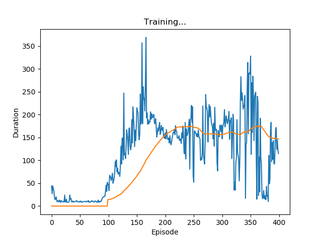

### EECS 598 Deep Learning
### Assignment 4
---
*Shuyang HUANG*
*68621288*

---

#### 1. Deep Q-Network (DQN)

With all blocks filled, after trainning, we get the following result.

  

Notice that, the model we used is a combination of two full-connecte layers with dimension $(4-64)$ and $(64-2)$, plus a relu layer as the intermediate layer. 

#### 2. Policy Gradients
##### 2.1

Notice,
$$
\nabla_{\theta} p(\tau ; \theta)=p(\tau ; \theta) \frac{\nabla_{\theta} p(\tau ; \theta)}{p(\tau ; \theta)}=p(\tau ; \theta) \nabla_{\theta} \log p(\tau ; \theta)
$$
Also notice,
$$
\begin{align*}
p(\tau ; \theta) & =\prod_{t \geq 0} p\left(s_{t+1} | s_{t}, a_{t}\right) \pi_{\theta}\left(a_{t} | s_{t}\right) \\ 
\log p(\tau ; \theta) & =\sum_{t \geq 0} \log p\left(s_{t+1} | s_{t}, a_{t}\right)+\log \pi_{\theta}\left(a_{t} | s_{t}\right) \\
\nabla_{\theta} \log p(\tau ; \theta) & =\sum_{t \geq 0} \nabla_{\theta} \log \pi_{\theta}\left(a_{t} | s_{t}\right)
\end{align*}
$$
Expand the agent’s objective,
$$
J(\theta) = \mathbb{E}_{\tau \sim p(\tau;\theta)}[r(\tau)]=\int_{\tau} r(\tau) p(\tau ; \theta) \mathrm{d} \tau
$$
Take the gradient of $\theta​$ on both side,
$$
\begin{align*}
\nabla_{\theta} J(\theta)&=\int_{\tau} r(\tau) \nabla_{\theta} p(\tau ; \theta) \mathrm{d} \tau \\
& = \int_{\tau}\left(r(\tau) \nabla_{\theta} \log p(\tau ; \theta)\right) p(\tau ; \theta) \mathrm{d} \tau \\ 
&=\mathbb{E}_{\tau \sim p(\tau ; \theta)}\left[r(\tau) \nabla_{\theta} \log p(\tau ; \theta)\right] \\
&=\mathbb{E}_{\tau \sim p(\tau ; \theta)}[r(\tau) \sum_{t \geq 0} \nabla_{\theta} \log \pi_{\theta}(a_{t} | s_{t})]
\end{align*}
$$
Consider a single episode $
\tau^i$ is also $\left(\left(a_{1}^{i}, s_{1}^{i}\right), \ldots,\left(a_{T}^{i}, s_{T}^{i}\right)\right)$, we have,
$$
\begin{align*}
\nabla_{\theta} J(\theta) & \approx \sum_{t=1}^{T} r(\tau^{i}) \nabla_{\theta} \log \pi_{\theta}\left(a_{t}^{i} | s_{t}^{i}\right) \\
& \approx \frac{1}{N} \sum_{i=1}^{N} \sum_{t=1}^{T} \nabla_{\theta} \log \pi_{\theta}\left(a_{t}^{i} | s_{t}^{i}\right) r\left(\tau^{i}\right)
\end{align*}
$$

##### 2.2

$$
\begin{align*}
\nabla_{\theta} J(\theta) & \approx \frac{1}{N} \sum_{i=1}^{N} \sum_{t=1}^{T} \nabla_{\theta} \log \pi_{\theta}\left(a_{t}^{i} | s_{t}^{i}\right) \sum_{t^{\prime}=1}^{T} r_{t^{\prime}}^{i} \\
& = \sum_{t=1}^{T}  \nabla_{\theta} \log \pi_{\theta}\left(a_{t} | s_{t}\right)r(\tau) \\
    & = \sum_{t'=1}^{T} r_{t'} \sum_{t=1}^{T}  \nabla_{\theta} \log \pi_{\theta}\left(a_{t} | s_{t}\right)  \\
    & = \sum_{t'=1}^{T} r_{t'} \sum_{t=1}^{t'}  \nabla_{\theta} \log \pi_{\theta}\left(a_{t} | s_{t}\right)
\end{align*}
$$
Expand all, and reorganize them, we have,
$$
\begin{align*}
\nabla_{\theta} J(\theta) & \approx \sum_{t=1}^{T} \nabla_{\theta} \log \pi_{\theta}\left(a_{t} | s_{t}\right) \sum_{t'=t}^{T} r_{t'} \\
& = \frac{1}{N} \sum_{i=1}^{N} \sum_{t=1}^{T} \nabla_{\theta} \log \pi_{\theta}\left(a_{t}^{i} | s_{t}^{i}\right) \sum_{t^{\prime}=t}^{T} r_{t^{\prime}}^{i}
\end{align*}
$$
Q.E.D.

#### 3. REINFORCE algorithm

